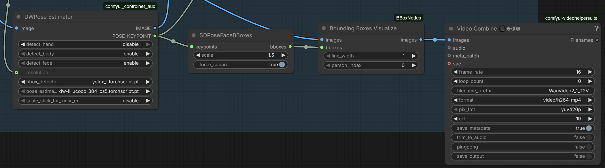
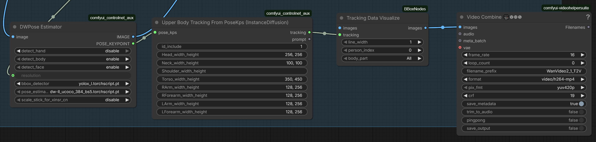
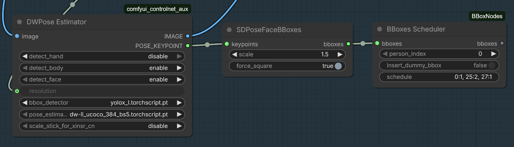
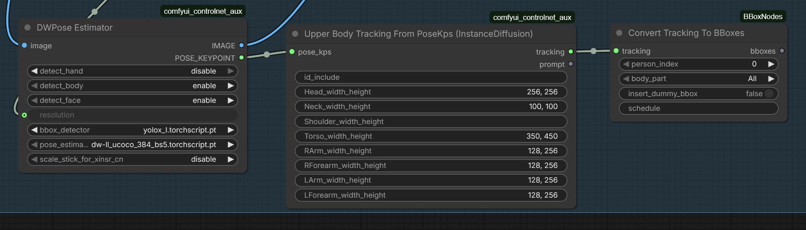

# ComfyUI-BBoxNodes
BBoxes (BoundingBoxes) handling and visualization nodes

BBox is a dict with 4 keys: {"x", "y", "w", "h"}, bboxes come as lists for each frame.

### BboxesVisualize

Visualizes BBoxes on given image/video by drawing color rectangles at bbox coords.
Also draws frame number on top left corner for convenience. 
Typically used with SDPoseFaceBBoxes node.

**INPUT**
- images: your image/video
- bboxes: list of bboxes from detector
- line_width: width of rectangle borders in pixels
- person_index: index of a bbox to draw per frame, when more than 1. 0 is to draw all bboxes, 1-... for specific bboxes

**OUTPUT**
- images: image/video with bboxes visualized. Each bbox on the image is drawn with a different color (red, green, blue, etc) to avoid confusion.

### TrackingVisualize

Visualizes Upper Body Tracking data on given image/video by drawing color rectangles at tracking data coords.
Also draws frame number on top left corner for convenience. 
Typically used with Upper Body Tracking From PoseKps (InstanceDiffusion) node.
Similar to KJ Node DrawInstanceDiffusionTracking and compatible with corresponding KJ nodes

**INPUT**
- images: your image/video
- tracking: TRACKING type custom data
- line_width: width of rectangle borders in pixels
- person_index: index of person body to draw per frame, if more than 1. 0 is to draw all bodies, 1-... for specific body
- body_part: select particular body part for drawing rectangles for

**OUTPUT**
- images: image/video with tracking data visualized. Each body part on the image is drawn with a different color (red, green, blue, etc) to avoid confusion.

### BBoxScheduler

Filters out specific bboxes based on the provided schedule. Typically used for precise picking of face bboxes per frame, when using a simple index is not enough, and bboxes jump from one person's face to another.

**INPUT**
- bboxes: list of bboxes from detector
- person_index: index of a bbox to select per frame, when more than 1. 0 is to select all bboxes, 1-... for specific bboxes
- insert_dummy_box: whether to insert a dummy one-pixel bbox into the list or not, when all were filtered out for given image/frame. Useful for cropping faces, when skipping   bboxes can cause issues
- schedule: optional string with schedules in 'frame_index:person_index' format, comma separated. Typically used for videos with mixed up bboxes. Starts picking specified person's bbox at the given frame and continues with that person up to the next schedule or end of the video, whichever comes first.
For example, schedule '0:1, 25:2, 27:1' means "starting from frame 0, select only first bbox for each frame, then from frame 25 use second bbox, and from frame 27 back to first"
Altough specifying person_index and schedule at the same time works as expected, it doesn't make much sense in general.

**OUTPUT**
- bboxes: list of filtered bboxes

### TrackingToBBoxScheduler

Converts tracking data to bboxes and filters out specific ones based on the provided schedule (just like the BBoxScheduler). Input compatible with KJ Nodes.

**INPUT**
- tracking: TRACKING type custom data
- person_index: index of a bbox to select per frame, when more than 1. 0 is to select all bboxes, 1-... for specific bboxes
- body_part: select particular body part from the tracking data to convert to bbox
- insert_dummy_box: whether to insert a dummy one-pixel bbox into the list or not, when all were filtered out for given image/frame. Useful for cropping faces, when skipping   bboxes can cause issues
- schedule: optional string with schedules in 'frame_index:person_index' format, comma separated. Works the same way as for BBoxScheduler

**OUTPUT**
- bboxes: list of converted and filtered bboxes

# Installation
1. Clone this repo into `custom_nodes` folder.
2. Install dependencies: `pip install -r requirements.txt`
   or if you use the portable install, run this in ComfyUI_windows_portable -folder:

  `python_embeded\python.exe -m pip install -r ComfyUI\custom_nodes\ComfyUI-BBoxNodes\requirements.txt`
   

# Changelog April 10th 2026
- **First nodes added: BboxesVisualize, TrackingVisualize, TrackingToBBoxScheduler, BBoxScheduler**